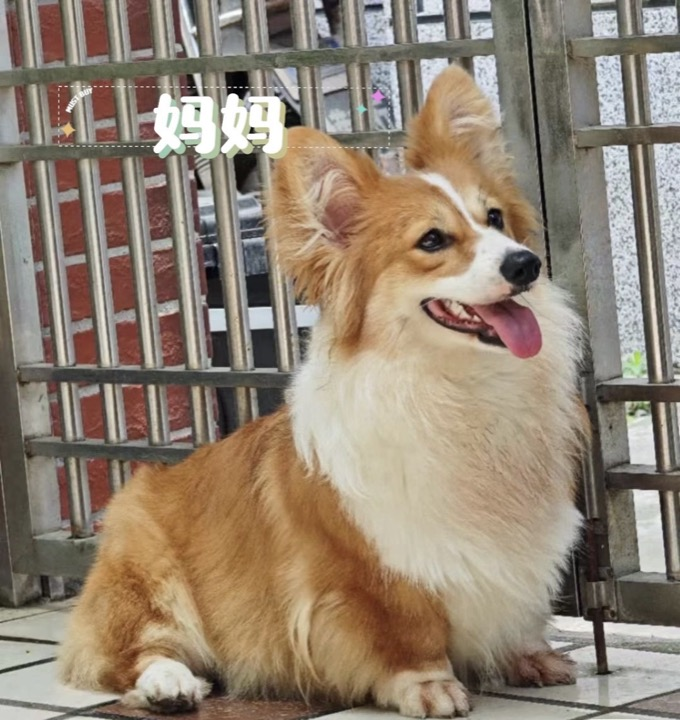
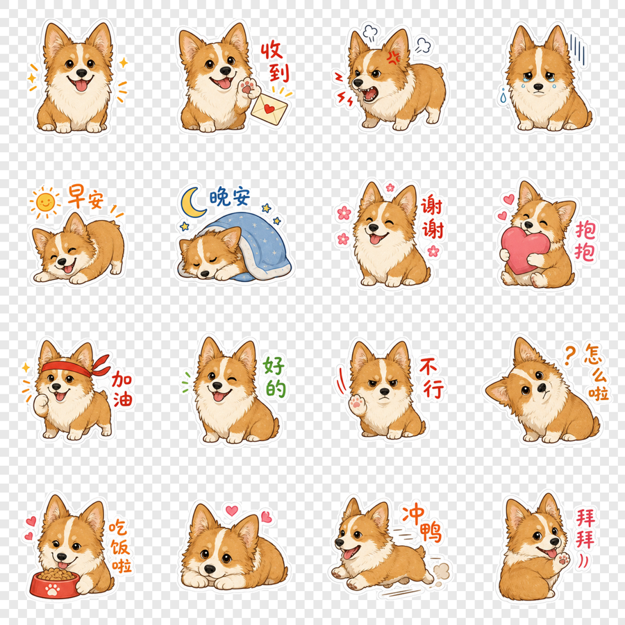
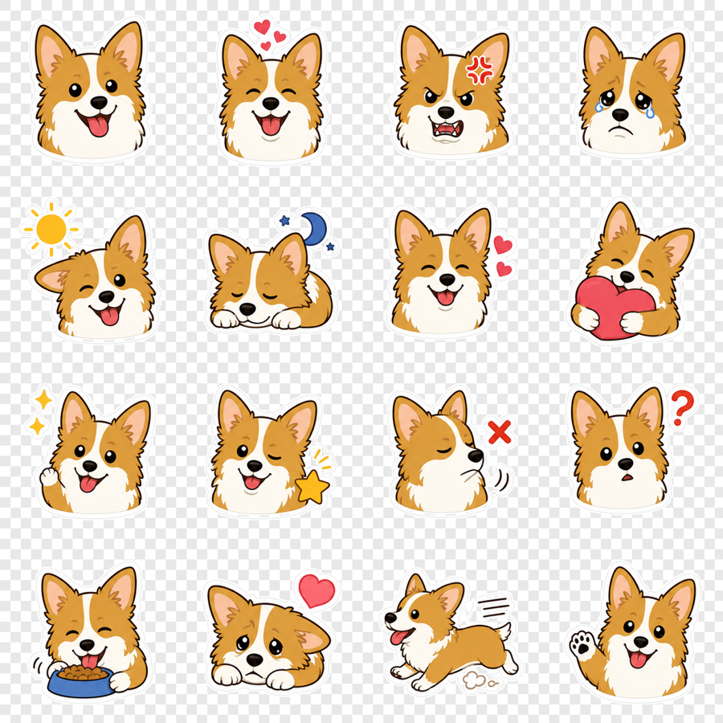
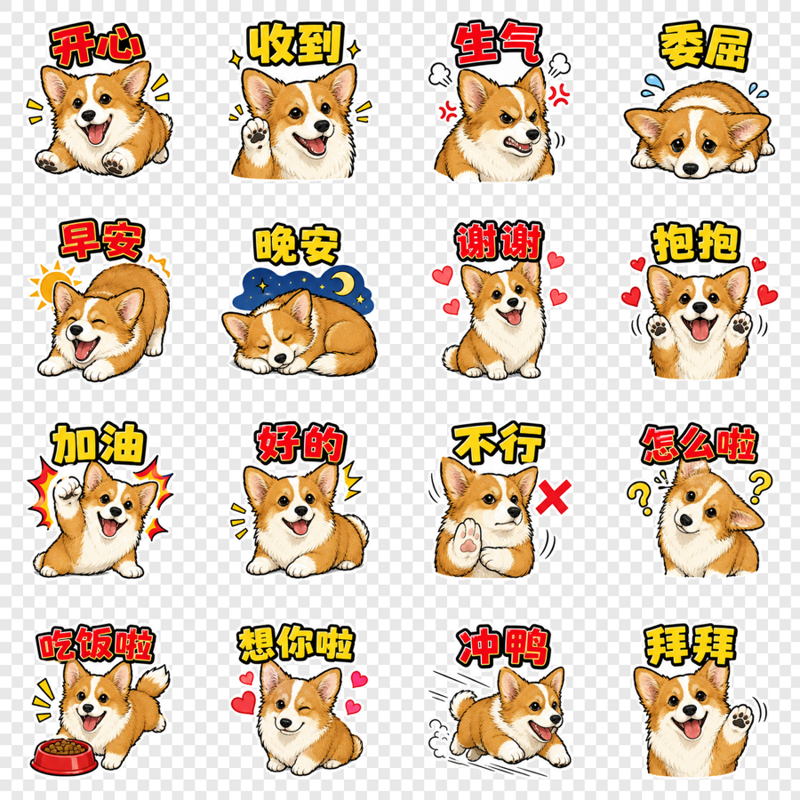
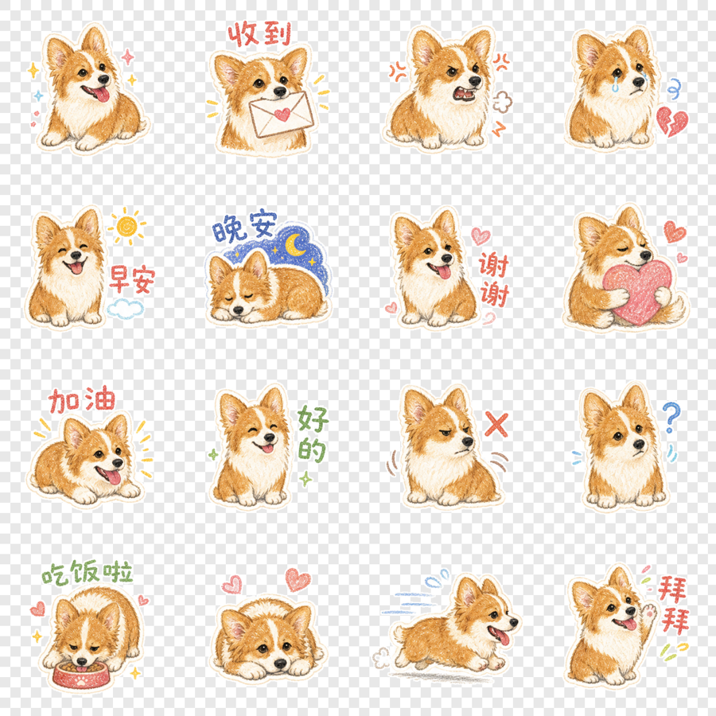
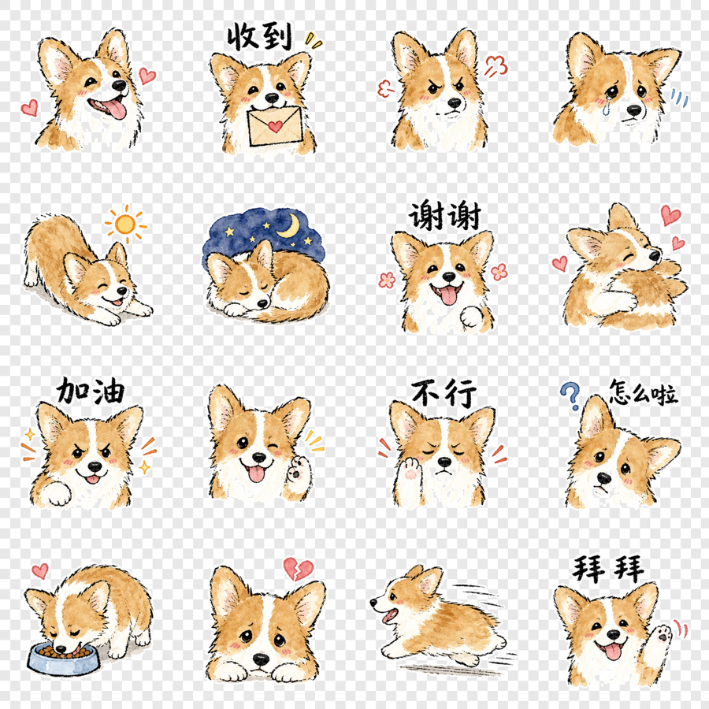
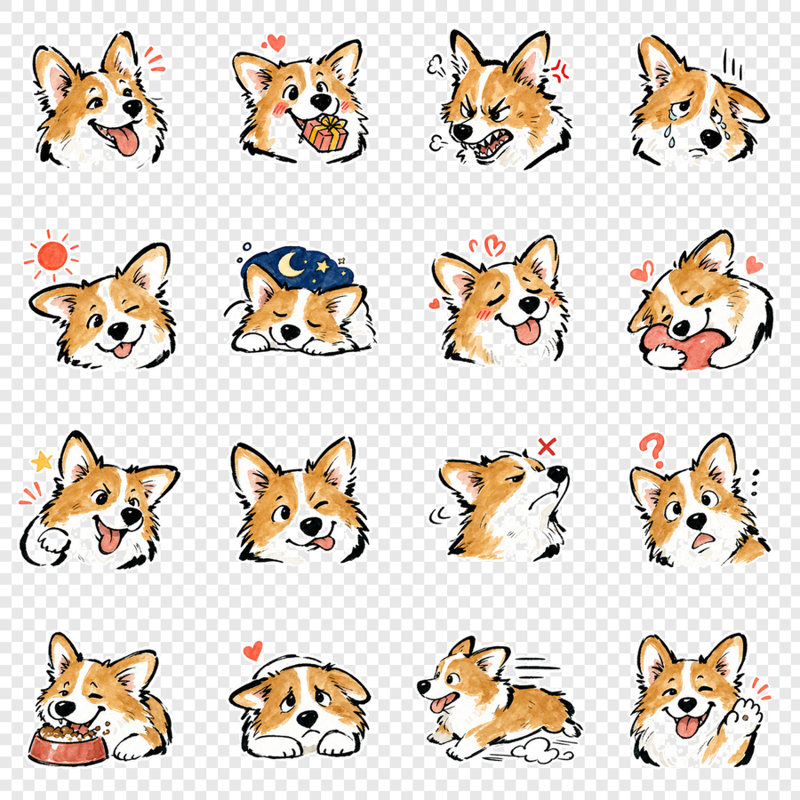

# Mr.Koi · 宠物 IP 表情工坊

> 一张照片，六种风格，16 张透明表情。

`koi-pet-stickers` 是一个面向 Codex 的宠物表情 Skill。上传 1 张宠物照片并提供
名字，即可生成一张适合小红书 REDSkill 展示的 `4×4` 表情大图，并自动提取
16 张透明 PNG。

- 默认风格：Q萌手绘贴纸
- 内置六种风格
- 不需要外部图像服务或 API Key
- 内置图像生成负责创作，本地脚本负责规范化、透明切图与验证
- 默认只要求切图完整；不承诺微信、小红书或其他平台审核一定通过

## 真实示例：皮皮

输入照片：

<p align="center">
  
</p>

| Q萌手绘贴纸 | 极简扁平 Emoji |
|---|---|
|  |  |

| 粗线漫画大字 | 蜡笔手帐涂鸦 |
|---|---|
|  |  |

| 稚拙墨线水彩 | 粗墨怪萌水彩 |
|---|---|
|  |  |

查看[皮皮完整示例与六套调用提示词](examples/pipi/README.md)。

## 安装

将仓库克隆到 Codex Skills 目录：

```bash
git clone https://github.com/mrkoi-is/koi-pet-stickers.git \
  "${CODEX_HOME:-$HOME/.codex}/skills/koi-pet-stickers"
```

新建 Codex 任务或重启 Codex，让 Skill 列表重新加载。

运行脚本需要 `uv`；Python 图像依赖已声明在脚本中，会由 `uv` 隔离解析，不需要
配置图像 API Key。

## 最简使用

上传宠物照片后输入：

```text
使用 $koi-pet-stickers，用我上传的宠物照片和名字“皮皮”生成表情包。
```

指定风格：

```text
使用 $koi-pet-stickers，用我上传的宠物照片和名字“皮皮”，采用“粗墨怪萌水彩”风格生成表情包。
```

未指定风格时默认使用 `q-cute-handdrawn`。

## 六种风格

| `style_id` | 中文名称 | 文字策略 |
|---|---|---|
| `q-cute-handdrawn` | Q萌手绘贴纸 | 混合短中文 |
| `flat-emoji` | 极简扁平 Emoji | 默认无字 |
| `bold-comic` | 粗线漫画大字 | 16 格大字 |
| `crayon-journal` | 蜡笔手帐涂鸦 | 稀疏手写字 |
| `naive-ink-watercolor` | 稚拙墨线水彩 | 少量松弛手写字 |
| `bold-ink-caricature` | 粗墨怪萌水彩 | 默认无字 |

## 默认交付

```text
work/pet-ip-runs/<宠物名>-<style_id>-<任务ID或时间戳>/
├── source-sheet.png
├── transparent-preview.png
├── transparent-cells/
│   ├── 01-happy.png
│   ├── ...
│   └── 16-bye.png
├── generation-prompt.txt
├── extract-result.json
├── source-qa.json
└── diagnostics/
```

默认交付包含：

- 一张纯白背景 `4×4` 源大图
- 16 张透明 RGBA PNG
- 一张透明棋盘格预览
- 本次提示词与切图 QA 记录

只有明确要求企业级完整包时，才额外生成 `1024×1024` master、manifest、
contact sheet 和机器验证报告。

## 工作边界

- 只处理单个宠物角色。
- 身份只来自用户照片，不复刻照片背景、装饰或原有文字。
- 只使用 Codex 内置图像生成，不调用外部图像服务。
- 本地脚本不补画、不改字，只做照片规范化、裁切、透明化、缩放、打包和验证。
- 用户负责确认照片、字体、商标、角色及生成成果的合法使用权。

## 开发验证

```bash
uv run --with PyYAML python \
  "$HOME/.codex/skills/.system/skill-creator/scripts/quick_validate.py" .

uv run --with Pillow==12.3.0 python -m unittest discover \
  -s tests -p 'test_*.py' -v
```

## 作者与授权

作者：**Mr.Koi**

个人及非商用使用免费。任何商业使用、转售、集成、代客服务或商业成果使用，
均须取得 Mr.Koi 的书面授权。

- 完整许可：[LICENSE](LICENSE)
- 商用协议模板：[COMMERCIAL-LICENSE.md](COMMERCIAL-LICENSE.md)
- 商用联系：`i@mrkoi.is`
